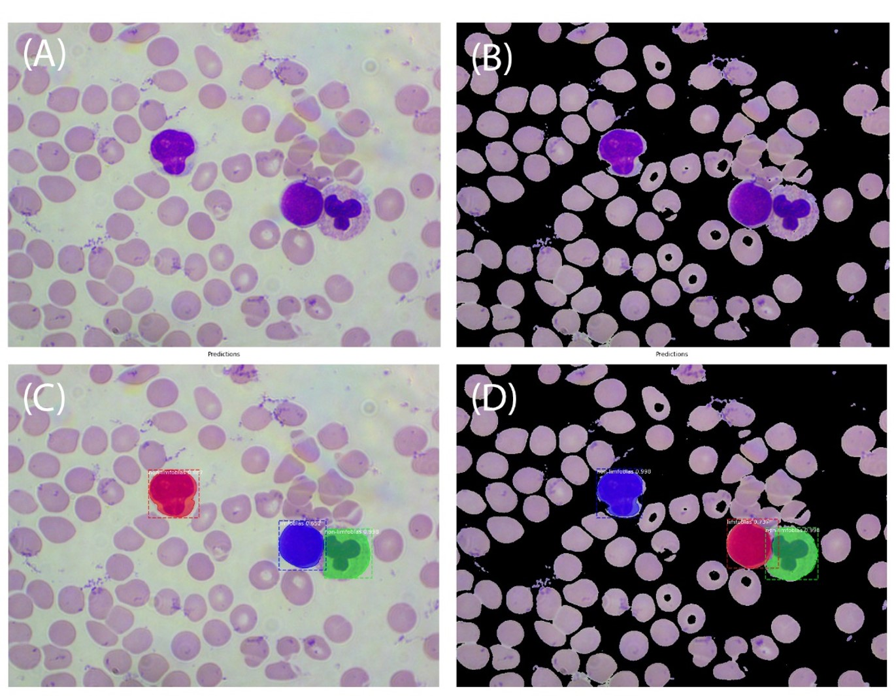
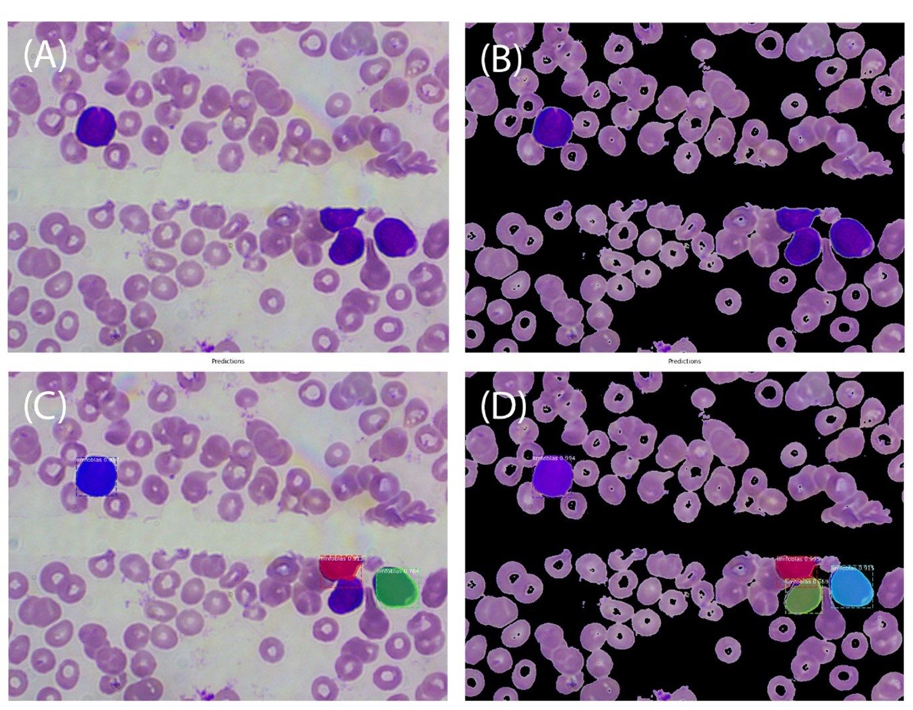
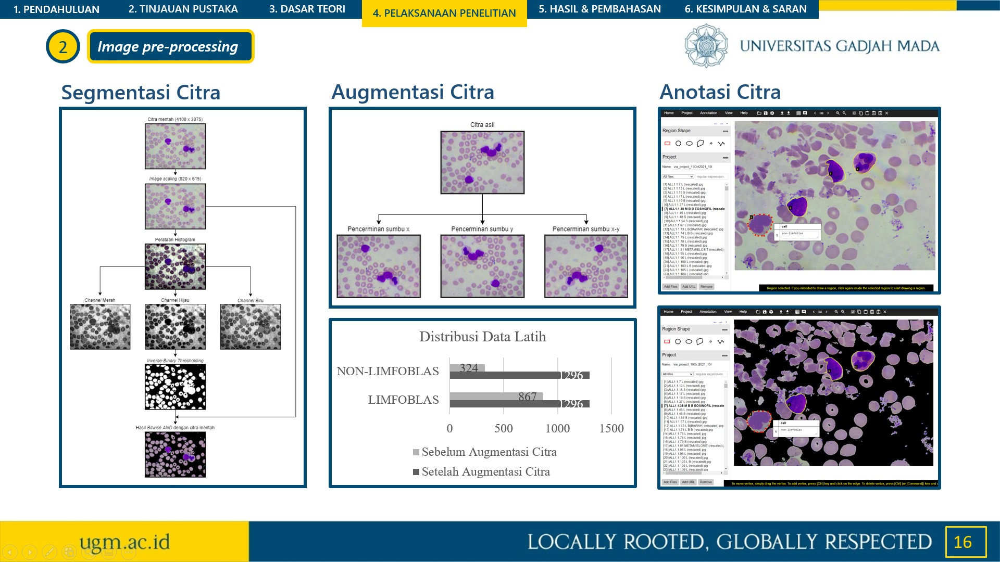
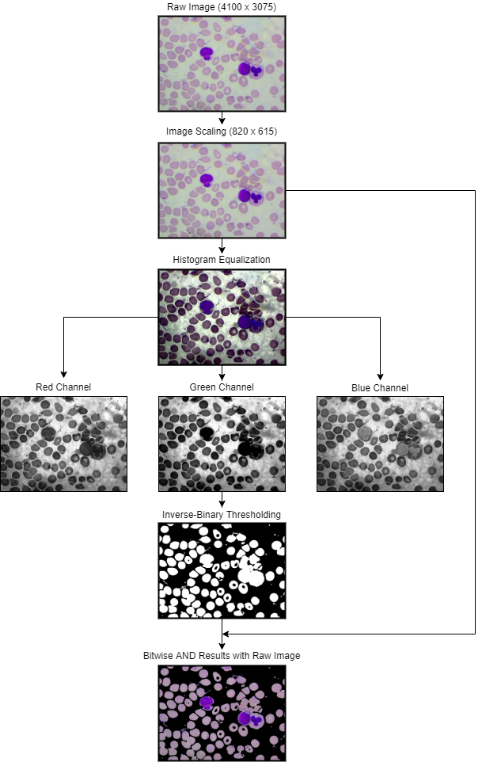

# Detection and Instance Segmentation of White Blood Cells Based on Mask R-CNN in Acute Lymphoblastic Leukemia L1 Patient

    

    Example detection result 1

  

    

    Example detection result 2

  

    

    Image pre-processing

  

    

    Image augmentation

