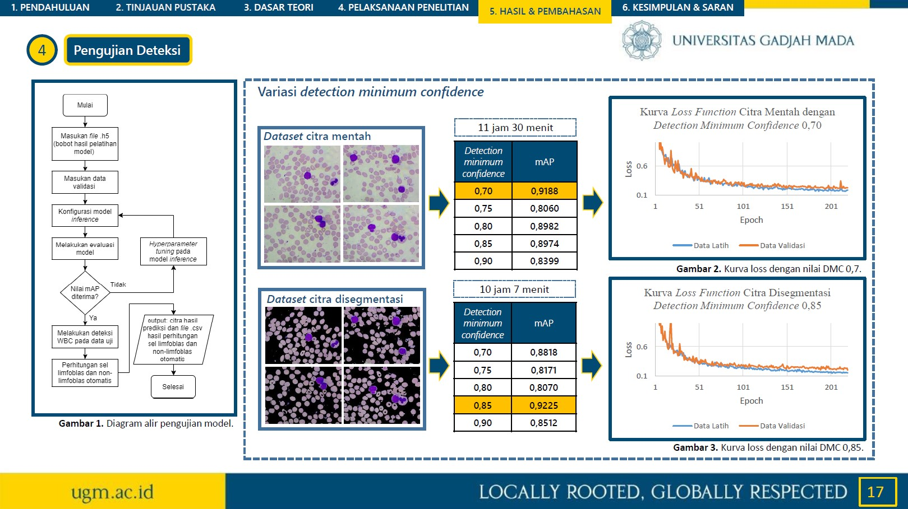

# Detection and Instance Segmentation of White Blood Cells Based on Mask R-CNN in Acute Lymphoblastic Leukemia L1 Patient

    

    Example Detection Result 1

  

    

    Example Detection Result 2

  

    

    Data Exploration and Data Splitting (train, validation, & test set)

  

    

    Image Pre-processing (Segmentation, Augmentation, and Annotation)

  

    

    Image Segmentation

  

    

 

    Model Training (optimal-fitting)

  

    

 

    Model Hyperparameters

    

 

    Model Performance

  
